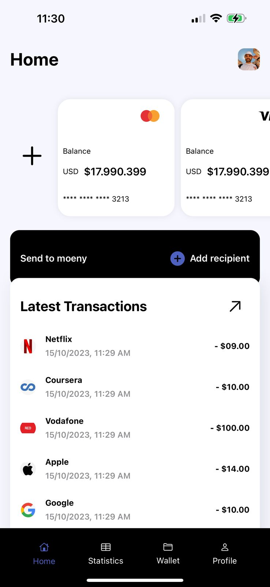
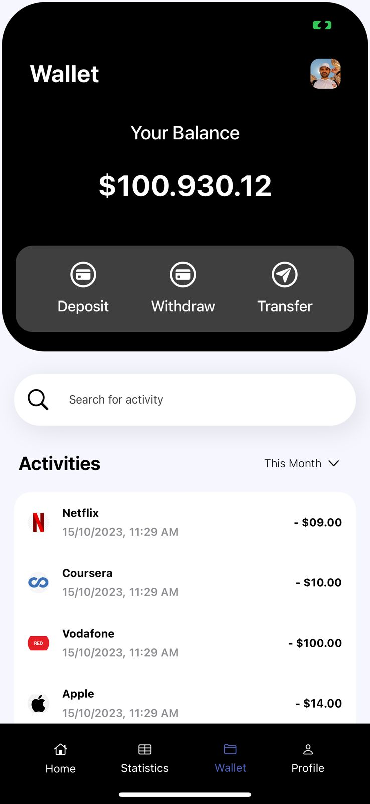
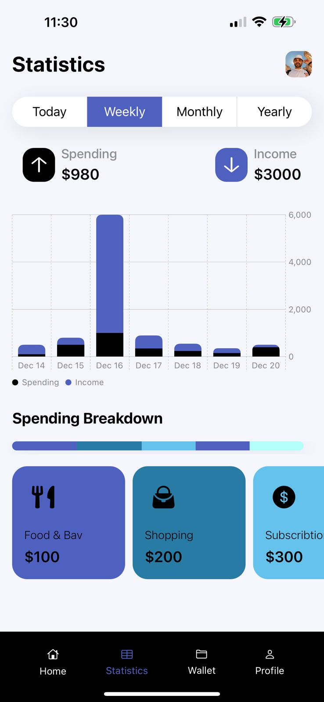
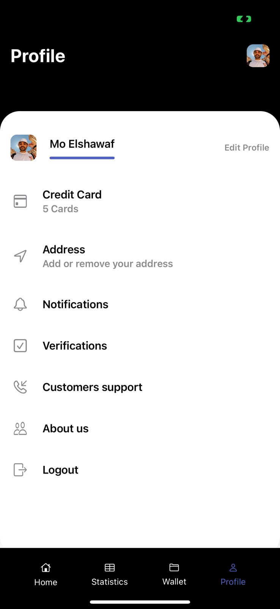

# Banking App

### 💰 A Simple Banking App that's build with 
- SwiftUI 
- Firebase Firestore
- MVVM
  
|                                      :information_source: This app Still a WORK IN PROGRESS                                               |
|-------------------------------------------------------------------------------------------------------------------------------------------|

### 📱 Screenshots  
| Home | Wallet | Statistics | Profile | 
|------|--------|------------|---------|
| | |  |  |

### 📝 Feature List 
- [ ] Authorization
- [X] Home
- [X] Wallet
- [X] Statistics
- [X] Profile
- [ ] Cards Management
- [ ] Light and Dark Modes.

### 🎨 Desing Inspired by [Link](https://dribbble.com/shots/14828147-money-management?utm_source=Clipboard_Shot&utm_campaign=arcimaryam&utm_content=money%20management&utm_medium=Social_Share&utm_source=Clipboard_Shot&utm_campaign=arcimaryam&utm_content=money%20management&utm_medium=Social_Share)

